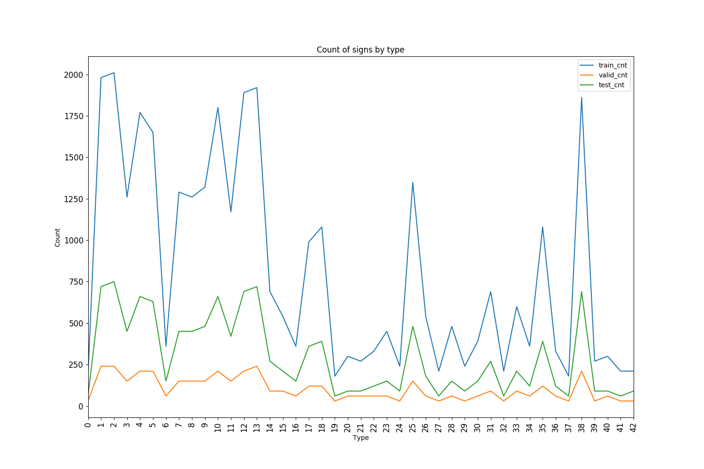

#**Traffic Sign Recognition**

##Writeup Template

---

**Build a Traffic Sign Recognition Project**

The goals / steps of this project are the following:
* Load the data set (see below for links to the project data set)
* Explore, summarize and visualize the data set
* Design, train and test a model architecture
* Use the model to make predictions on new images
* Analyze the softmax probabilities of the new images
* Summarize the results with a written report

--

###Writeup / README

####1. Provide a Writeup / README that includes all the rubric points and how you addressed each one. You can submit your writeup as markdown or pdf. You can use this template as a guide for writing the report. The submission includes the project code.

You're reading it! and here is a link to my [project code](model.py)

###Data Set Summary & Exploration

####1. Provide a basic summary of the data set. In the code, the analysis should be done using python, numpy and/or pandas methods rather than hardcoding results manually.

I used numpy to calculate summary statistics of the traffic
signs data set:

* The size of training set is 34799
* The size of the validation set is 12630
* The size of test set is 4410
* The shape of a traffic sign image is 32
* The number of unique classes/labels in the data set is 43

####2. Include an exploratory visualization of the dataset.

Here is an exploratory visualization of the data set. It is a line chart showing the distribution of number of images per class for each data set. We can see that the distribution is even across data-set but not necessarily across class. Since some classes do not have a lot of training data, the model might not perform well on them.

###Design and Test a Model Architecture

####1. Describe how you preprocessed the image data. What techniques were chosen and why did you choose these techniques? Consider including images showing the output of each preprocessing technique. Pre-processing refers to techniques such as converting to grayscale, normalization, etc. (OPTIONAL: As described in the "Stand Out Suggestions" part of the rubric, if you generated additional data for training, describe why you decided to generate additional data, how you generated the data, and provide example images of the additional data. Then describe the characteristics of the augmented training set like number of images in the set, number of images for each class, etc.)

As a first step, I standardized the images by centering the dataset around 128.

I decided not to gray-scale the images because color is an important feature of traffic signs and we would be losing valuable data by gray-scaling. Given more time, a more advanced approach would be to convert an alternate system like HSV or HSL and isolate only the colors that matter for traffic signs (white, red, black, yellow, orange, blue, green).

When analyzing the model performance, I noticed that most of the errors came from classes with smaller number of samples, so this is where data augmentation or re-sampling would be useful. I did not have time to implement data augmentation, but here's what my approach would be:
- up-sampling the minority classes with a very simple transformation (e.g.: shift x pixels)
- synthesize more data with advanced transformations

####2. Describe what your final model architecture looks like including model type, layers, layer sizes, connectivity, etc.) Consider including a diagram and/or table describing the final model.

My final model consisted of the following layers:

| Layer         		|     Description	        					|
|:---------------------:|:---------------------------------------------:|
| Input         		| 32x32x3 RGB image   							|
| Convolution 5x5     	| 1x1 stride, same padding, outputs 28x28x6 	|
| RELU					|												|
| Max pooling	      	| 2x2 stride,  outputs 14x14x6 				|
| Convolution 5x5	    | 1x1 stride, same padding, outputs 10x10x16			|
| RELU |
| Max pooling	      	| 2x2 stride,  outputs 5x5x16 				|
| Flaten | outputs 400 |
| Fully connected		| output 120        									|
| RELU |
| Dropout | |
| Fully connected		| output 84        									|
| RELU |
| Dropout | |
| Fully connected		| output 43        									|
| RELU |
| Dropout | |
| Softmax				|         									|

####3. Describe how you trained your model. The discussion can include the type of optimizer, the batch size, number of epochs and any hyperparameters such as learning rate.

To train the model, I used the Adam Optimizer that minimizes the loss function.

I tuned three hyper-parameters:
- batch size: 32, 64: 128
- learning rate: .001, .0005, .0001
- keep_prob: .5, .6, .75
- epoch: 10, 20, 30, 40

The best parameters I found are: (.001,.5,128, 30)

####4. Describe the approach taken for finding a solution and getting the validation set accuracy to be at least 0.93. Include in the discussion the results on the training, validation and test sets and where in the code these were calculated. Your approach may have been an iterative process, in which case, outline the steps you took to get to the final solution and why you chose those steps. Perhaps your solution involved an already well known implementation or architecture. In this case, discuss why you think the architecture is suitable for the current problem.

My final model results were:
* training set accuracy of .997
* validation set accuracy of .970
* test set accuracy of .940

If an iterative approach was chosen:
* What was the first architecture that was tried and why was it chosen?
  - I started with the LeNet architecture because signs and digits are structurally similar objects. There are a lot of low-level features like edges and boundaries that are shared among images. LeNet has done the heavy lifting with such feature detection so re-using this architecture is a good starting point.

* What were some problems with the initial architecture?
  - LeNet assumes gray-scale images. Since I decided explicitly to keep my images in color, I needed to modify the initial depth of the first convolutional network weight.
  - In addition, LeNet has 10 classes whereas for traffic sign we have 43. So the final fully connected layer needs to be adjusted accordingly.

* How was the architecture adjusted and why was it adjusted? Typical adjustments could include choosing a different model architecture, adding or taking away layers (pooling, dropout, convolution, etc), using an activation function or changing the activation function. One common justification for adjusting an architecture would be due to overfitting or underfitting. A high accuracy on the training set but low accuracy on the validation set indicates over fitting; a low accuracy on both sets indicates under fitting.
  - LeNet immediately produced excellent training accuracy right off the bat, so most of my time was focused on addressing over-fitting to improve validation set accuracy.
  - I added a dropout layer after each of the first two fully connected networks.

* Which parameters were tuned? How were they adjusted and why?
  - Learning rate produced the biggest impact, as training accuracy jumped from <.8 to >.99 once I found the best value.
  - Dropout's keep_prob was the next most impactful hyper-parameter.
  - Increasing the number of epochs might result in overfitting. By balancing dropout with epochs, I was able to get better accuracy on the validation set.
  - Batch size was not particularly impactful, so I selected the largest number possible for my system to make training faster.

* What are some of the important design choices and why were they chosen? For example, why might a convolution layer work well with this problem? How might a dropout layer help with creating a successful model?
  - Convolution works well with this problem because traffic signs have very well defined features. There is always some sort of boundary, color, and inner shape. Traffic signs need to be made clear for humans to see, so there is rarely any significant overlap of visual details among different classes. Convolution is able to pick up these features fairly easily.
  - Drop-out also works well in this case because it forces the network to not rely too heavily on some of the dominant features (color, shape) and instead work on higher-level features like what's actually inside the box.

###Test a Model on New Images

####1. Choose five German traffic signs found on the web and provide them in the report. For each image, discuss what quality or qualities might be difficult to classify.

Here are five German traffic signs that I found on the web:

- has watermark which could represent dust in real life condition

- the original image was not square so I stretched it. This could represent different viewing angles.

- has a tree background

- slightly tilted

- one of the classes with small number of examples
- has additional crossing lines that are not present in training images

####2. Discuss the model's predictions on these new traffic signs and compare the results to predicting on the test set. At a minimum, discuss what the predictions were, the accuracy on these new predictions, and compare the accuracy to the accuracy on the test set (OPTIONAL: Discuss the results in more detail as described in the "Stand Out Suggestions" part of the rubric).

Here are the results of the prediction:

| Image			        |     Prediction	        					|
|:---------------------:|:---------------------------------------------:|
| Speed Limit 30      		| Speed Limit 30   									|
| Right of Way     			| Right of Way 										|
| Slippery Road					| Slippery Road											|
| Road Work	      		| Road Work					 				|
| Pedestrian			| General Caution      							|

The model was able to correctly guess 4 of the 5 traffic signs, which gives an accuracy of 80%, or 5 out of 5, depending on the run. The odd ball is the Pedestrian sign.

By contrast, the test set accuracy .940. 5 samples is too small to compare, however.

It is important to note that the Pedestrian image is a big curve ball because it contains extra details. So while a human might be able to infer despite those extra details, a machine cannot.

####3. Describe how certain the model is when predicting on each of the five new images by looking at the softmax probabilities for each prediction. Provide the top 5 softmax probabilities for each image along with the sign type of each probability. (OPTIONAL: as described in the "Stand Out Suggestions" part of the rubric, visualizations can also be provided such as bar charts)

| Image			        |     Top 5 softmax	      					|
|:---------------------:|:---------------------------------------------:|
| Speed Limit 30      		| .99 0 0 0 0 0  									|
| Right of Way     			|.99 0 0 0 0 0 										|
| Slippery Road					|.99 0 0 0 0 0											|
| Road Work	      		| .99 0 0 0 0 0				 				|
| Pedestrian			| .99 0 0 0 0 0      							|

It's interesting that the algorithm shows almost 100% certainly for each image, including the pedestrian misclassification
